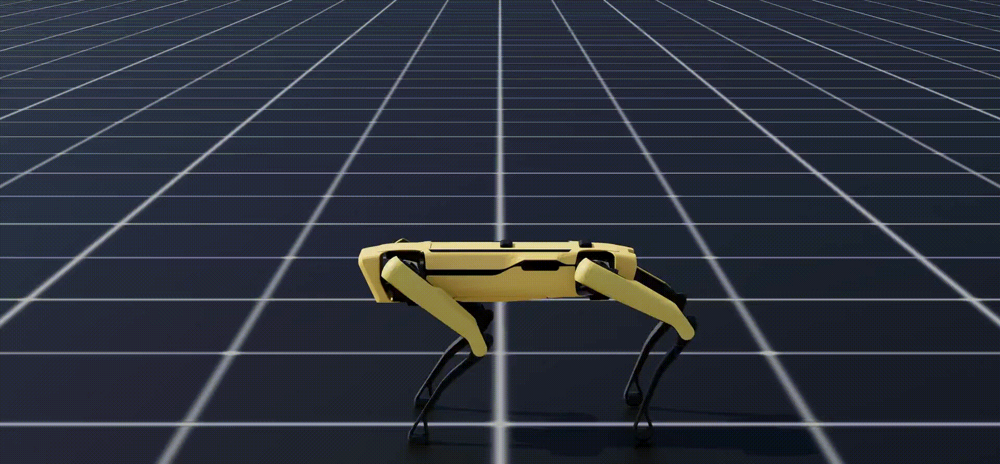
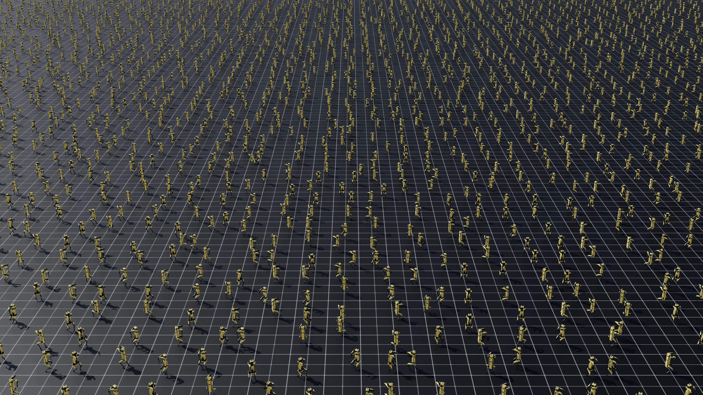

---

# Spot RL Train

[](https://docs.isaacsim.omniverse.nvidia.com/latest/index.html)
[](https://docs.python.org/3/whatsnew/3.11.html)
[](https://github.com/SaxionMechatronics/spot_rl_train/blob/main/.github/workflows/pre-commit.yaml)
[](https://opensource.org/licenses/BSD-3-Clause)

Reinforcement learning environments and training infrastructure for the Boston Dynamics Spot
quadruped, built as a standalone [Isaac Lab](https://isaac-sim.github.io/IsaacLab/) extension.

Policies are trained with PPO via [RSL-RL](https://github.com/leggedrobotics/rsl_rl) on
NVIDIA Isaac Sim, using Isaac Lab's manager-based RL workflow. The extension lives outside the
core Isaac Lab repository, so it can be developed and versioned independently.

## Tasks

| Task ID | Description |
|---|---|
| `Spot-Rl-Locomotion-v0` | Velocity-tracking locomotion over procedurally generated cobblestone-road terrain, with a terrain-level curriculum and domain randomization (friction, base mass, pushes). |
| `Spot-Rl-Locomotion-Play-v0` | Evaluation variant: fewer environments, flat terrain levels, randomization and observation noise disabled. |
| `Spot-Rl-Handstand-v0` | Front-handstand balancing: the robot lifts its hind legs and holds an inverted posture. |
| `Spot-Rl-Handstand-Play-v0` | Evaluation variant of the handstand task. |



## Installation

This project targets **Isaac Lab v2.3.2**.

1. Install Isaac Lab v2.3.2 by following the
   [installation guide](https://isaac-sim.github.io/IsaacLab/main/source/setup/installation/index.html),
   checking out the tag before installing:

   ```bash
   git clone https://github.com/isaac-sim/IsaacLab.git
   cd IsaacLab && git checkout v2.3.2
   ```

2. Clone this repository outside your `IsaacLab` directory:

   ```bash
   git clone git@github.com:SaxionMechatronics/spot_rl_train.git && cd spot_rl_train
   ```

3. Install the extension in editable mode:

   ```bash
   conda activate env_isaaclab
   python -m pip install -e source/spot_rl_train
   ```

4. Verify the install by listing the registered environments — you should see the four tasks above:

   ```bash
   python scripts/list_envs.py
   ```

## Usage

### Training

```bash
python scripts/rsl_rl/train.py --task=Spot-Rl-Locomotion-v0
```

Typical flags:

```bash
# headless, large batch — the usual training configuration
python scripts/rsl_rl/train.py --task=Spot-Rl-Locomotion-v0 --num_envs=4096 --headless

# fix a seed for reproducibility, and cap iterations
python scripts/rsl_rl/train.py --task=Spot-Rl-Locomotion-v0 --seed=1 --max_iterations=10000

# resume from a checkpoint
python scripts/rsl_rl/train.py --task=Spot-Rl-Locomotion-v0 --resume --checkpoint=/path/to/model.pt

# record videos during training
python scripts/rsl_rl/train.py --task=Spot-Rl-Locomotion-v0 --headless --video --video_interval=2000

# multi-GPU / multi-node
python scripts/rsl_rl/train.py --task=Spot-Rl-Locomotion-v0 --headless --distributed
```

### Running a trained policy

```bash
python scripts/rsl_rl/play.py --task=Spot-Rl-Locomotion-Play-v0 --num_envs=32
```

This loads the latest checkpoint unless one is given with `--checkpoint`.

### Sanity-checking an environment

Run a task with a zero-action agent to confirm the environment builds and steps correctly — useful
after editing a config:

```bash
python scripts/zero_agent.py --task=Spot-Rl-Locomotion-v0 --num_envs=4
```

## License

BSD-3-Clause. This project builds on the
[Isaac Lab](https://github.com/isaac-sim/IsaacLab) framework, also BSD-3-Clause licensed.

## Contact

Kousheek Chakraborty - kousheekc@gmail.com

Project Link: https://github.com/SaxionMechatronics/spot_rl_train

If you encounter any difficulties, feel free to reach out through the Issues section. If you find any bugs or have improvements to suggest, don't hesitate to make a pull request.

## Citation

If you use this work in your research, please cite:

```bibtex
@inproceedings{chakraborty2026actuator,
  author    = {Chakraborty, Kousheek and Rajendra, Chandan K. and Alharbat, Ayham and Mersha, Abeje Y.},
  title     = {Actuator Dynamics Curricula for Narrow-Viability Tasks in Legged Robot Learning},
  booktitle = {Conference on Robot Learning (CoRL)},
  year      = {2026},
}
```
